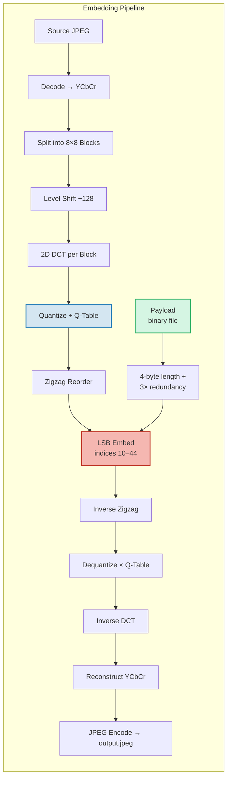
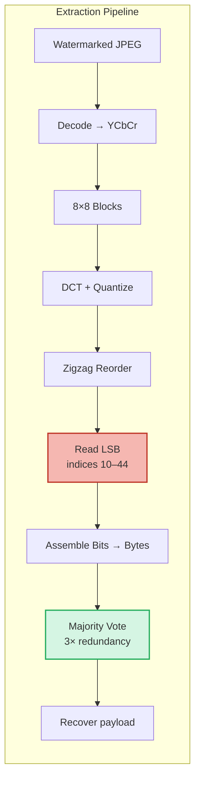
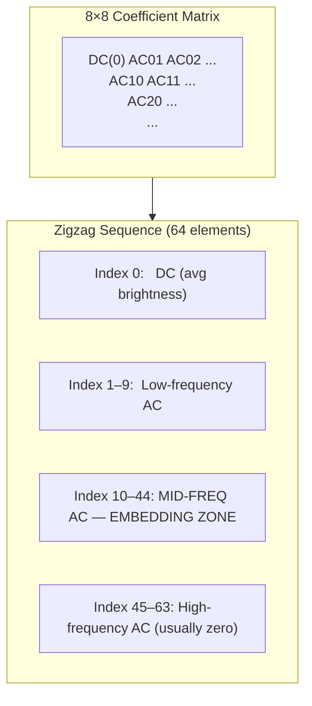
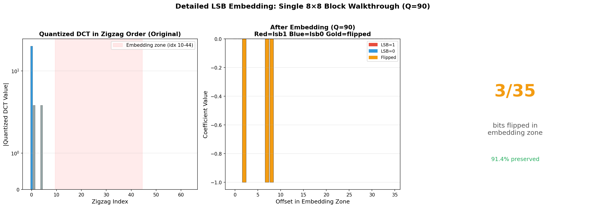
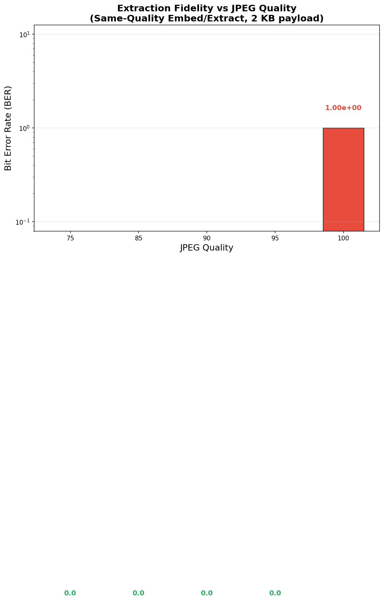
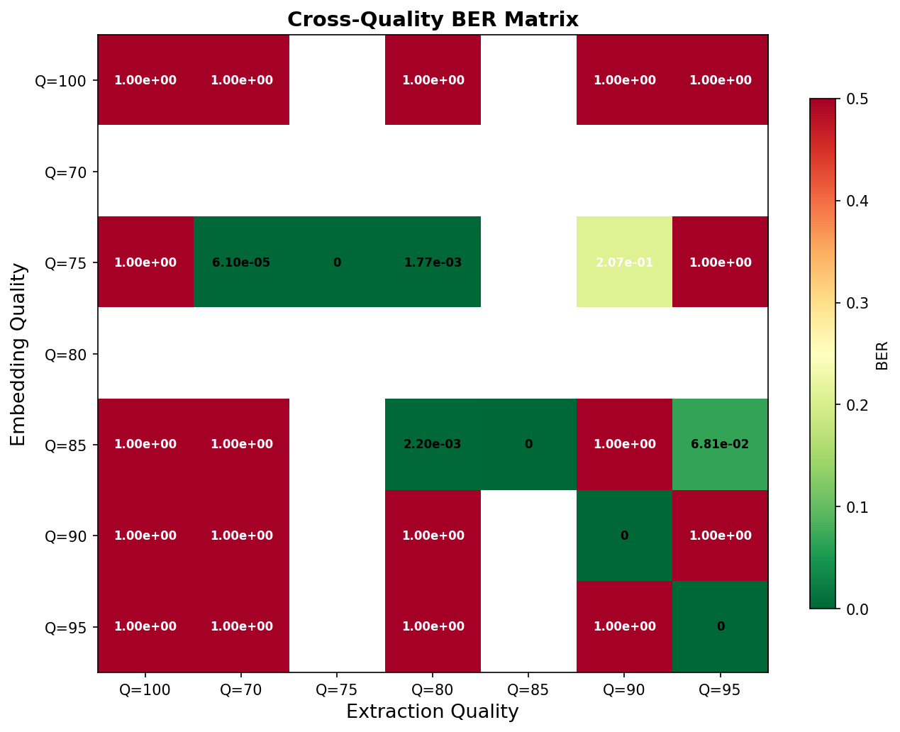
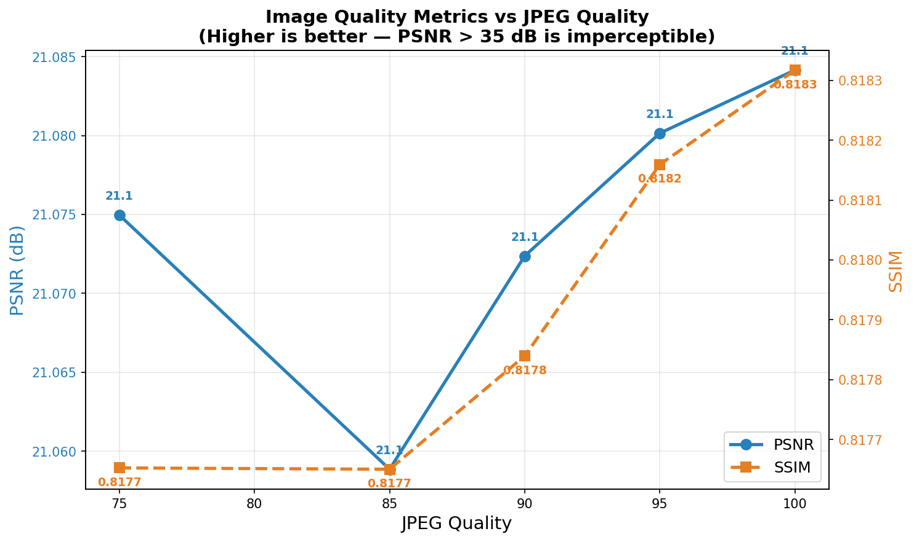
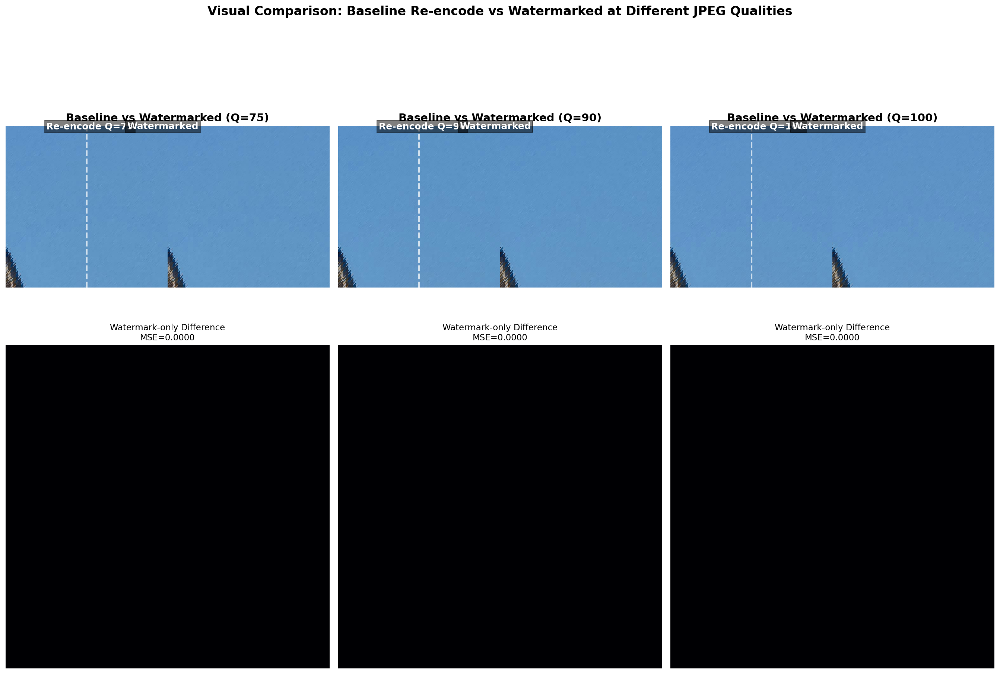
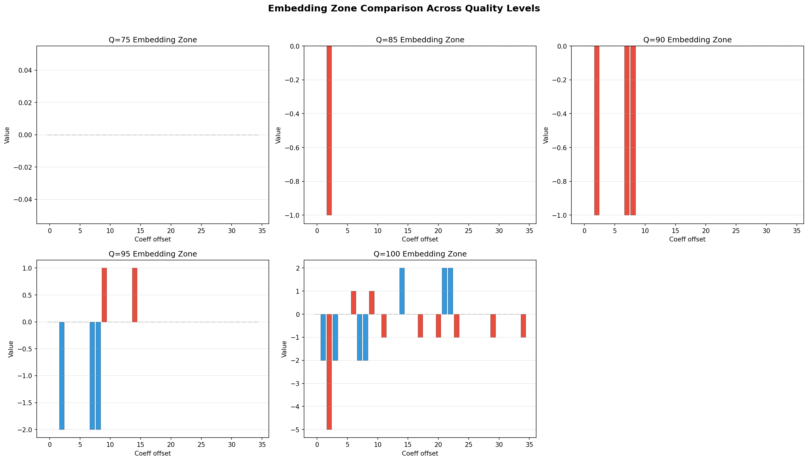
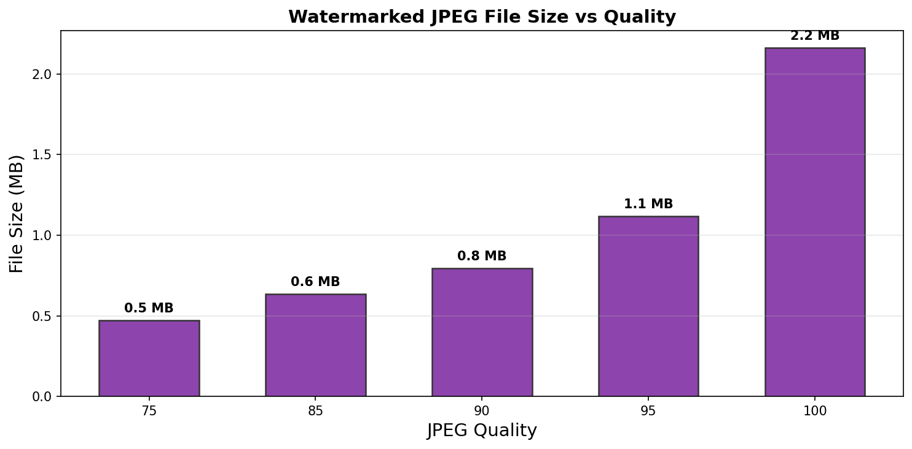

# rrwm — JPEG DCT Watermarking

Embed and extract arbitrary binary payloads inside JPEG images by manipulating the
least-significant bits of quantized DCT coefficients. Operates on the Y, Cb, and Cr
channels independently, with triple-byte redundancy for robust extraction.

**Capacity** on a 50 MP JPEG (6144×8160): ~1.7 MB usable payload after 3× redundancy.

## Contents

- [Part 1 — How the Watermarking Works](#part-1--how-the-watermarking-works)
  - [1.1 Pipeline Overview](#11-pipeline-overview)
  - [1.2 Color Space: RGB → YCbCr](#12-color-space-rgb--ycbcr)
  - [1.3 8×8 Block Partitioning](#13-8×8-block-partitioning)
  - [1.4 The DCT Transform](#14-the-dct-transform)
  - [1.5 Quantization](#15-quantization)
  - [1.6 Zigzag Ordering](#16-zigzag-ordering)
  - [1.7 LSB Embedding](#17-lsb-embedding)
  - [1.8 Extraction Pipeline](#18-extraction-pipeline)
  - [1.9 Triple Redundancy & Majority Voting](#19-triple-redundancy--majority-voting)
  - [1.10 Capacity Analysis](#110-capacity-analysis)
- [Part 2 — Quality Testing & Results](#part-2--quality-testing--results)
  - [2.1 Test Methodology](#21-test-methodology)
  - [2.2 BER vs JPEG Quality](#22-ber-vs-jpeg-quality)
  - [2.3 Cross-Quality Extraction](#23-cross-quality-extraction)
  - [2.4 Image Quality Metrics](#24-image-quality-metrics)
  - [2.5 Visual Comparison](#25-visual-comparison)
  - [2.6 Block-Level Analysis](#26-block-level-analysis)
  - [2.7 File Size Impact](#27-file-size-impact)
  - [2.8 Results Summary](#28-results-summary)

---

# Part 1 — How the Watermarking Works

## 1.1 Pipeline Overview

The watermarking pipeline converts a source JPEG into its DCT frequency
representation, embeds bits in selected mid-frequency coefficients via LSB
manipulation, then reconstructs the image. Extraction is the inverse path.





---

## 1.2 Color Space: RGB → YCbCr

JPEG internally uses the **YCbCr** color space, not RGB. This is critical for
watermarking because the three channels have very different properties:

| Channel | Name | Perception | JPEG Subsample | Our Usage |
|---------|------|-----------|----------------|-----------|
| **Y** | Luminance (brightness) | High sensitivity | Full resolution | 6-bit precision in bitstream |
| **Cb** | Blue-difference chroma | Low sensitivity | 4:2:0 (half res) | 5-bit precision, ~¼ the blocks of Y |
| **Cr** | Red-difference chroma | Low sensitivity | 4:2:0 (half res) | 5-bit precision, ~¼ the blocks of Y |

**Why this matters for watermarking**: Human vision is far less sensitive to
chrominance changes than luminance changes. This means Cb and Cr can carry
watermark data with less visible distortion. However, the chrominance quantization
table is also more aggressive (larger divisors), so bit flips in Cb/Cr may not
survive re-compression as well.

At **4:2:0 subsampling**, each Cb/Cr block covers a 16×16 pixel area of the
original image, while each Y block covers 8×8 pixels. This means for a 50 MP
image:
- **Y**: 768 × 1020 = **783,360 blocks**
- **Cb**: 384 × 510 = **195,840 blocks**
- **Cr**: 384 × 510 = **195,840 blocks**
- **Total**: **1,175,040 blocks**

---

## 1.3 8×8 Block Partitioning

Each channel plane is divided into non-overlapping 8×8 pixel blocks, processed
independently through the DCT pipeline in raster-scan order.

```
      8 pixels
   ┌──────────┐
   │          │
   │  8×8     │   → Forward DCT → Quantize → Zigzag → Embed →
   │  Block   │
   │          │
   └──────────┘
```

The block structure is the fundamental unit of the entire pipeline. All
subsequent operations (DCT, quantization, zigzag, LSB embedding) happen at the
block level.

---

## 1.4 The DCT Transform

### 1.4.1 Level Shift

Before the DCT, each pixel (0–255 unsigned) is shifted by subtracting 128 to
center around zero (−128…+127). This improves DCT energy compaction.

### 1.4.2 Forward DCT

Each 8×8 block of signed pixel values is transformed using the 2D Discrete
Cosine Transform (Type-II):

$$F(u,v) = \frac{1}{4} \cdot C_u \cdot C_v \cdot \sum_{i=0}^{7} \sum_{j=0}^{7} f(i,j) \cdot \cos\frac{(2i+1)u\pi}{16} \cdot \cos\frac{(2j+1)v\pi}{16}$$

Where $C_u = \frac{1}{\sqrt{2}}$ if $u=0$, else $1$ (same for $C_v$).

The DCT **concentrates energy** into low-frequency coefficients (top-left
corner of the 8×8 block). The DC coefficient (0,0) represents the average
brightness of the block; AC coefficients represent spatial frequencies.

### 1.4.3 Why DCT, Not Pixels?

Watermarking in the DCT domain rather than the pixel domain provides three
advantages:

1. **Imperceptibility**: A single DCT coefficient change distributes its effect
   across all 64 pixels in the block during the inverse transform, making it
   appear as distributed noise rather than a localized artifact.
2. **JPEG compatibility**: The watermark survives JPEG re-encoding because it is
   embedded at the same stage where JPEG compression operates.
3. **Frequency selection**: We can selectively modify mid-frequency coefficients
   that survive quantization better than high frequencies, while avoiding
   low-frequency coefficients that would cause visible distortion.

---

## 1.5 Quantization

Quantization is the lossy step that makes JPEG compression possible — and the
primary challenge for watermark survival.

Each DCT coefficient is divided by a corresponding entry from the quantization
table and rounded to the nearest integer:

$$Q(i,j) = \text{round}\left(\frac{DCT(i,j)}{Q_{table}(i,j)}\right)$$

### Quantization Tables

The JPEG standard defines default tables. Luminance (Y) has smaller divisors
(preserves more detail); chrominance (Cb/Cr) has larger divisors (more
aggressive compression).

**Luminance Q-Table (scaled to Q=90):**

```
  3   2   2   3   5   8  10  12
  2   2   3   4   5  12  12  11
  3   3   3   5   8  11  14  11
  3   3   4   6  10  17  16  12
  4   4   7  11  14  22  21  15
  5   7  11  13  16  21  23  18
 10  13  16  17  21  24  24  20
 14  18  19  20  22  20  21  20
```

**Chrominance Q-Table (scaled to Q=90):**

```
  3   4   5   9  20  20  20  20
  4   4   5  13  20  20  20  20
  5   5  11  20  20  20  20  20
  9  13  20  20  20  20  20  20
 20  20  20  20  20  20  20  20
 20  20  20  20  20  20  20  20
 20  20  20  20  20  20  20  20
 20  20  20  20  20  20  20  20
```

The scaling function for quality Q:

```
Q < 50:  scale = 5000 / Q
Q ≥ 50:  scale = 200 − Q×2

scaled[i] = clamp((base[i] × scale + 50) / 100, 1, 255)
```

**Key insight for watermarking**: After quantization, many coefficients become
zero. The LSB of a zero coefficient is always 0 — if we flip it to 1, we
change `0 → 1`. After dequantization, `1 × qtable_value` produces a small
non-zero value that manifests as low-level noise. This is the watermark signal.

---

## 1.6 Zigzag Ordering

After quantization, the 8×8 coefficient matrix is reordered into a 1D sequence
following a zigzag path through frequency space:



| Zigzag Range | Name | Used For |
|:---:|---|---|
| 0 | DC coefficient | Average brightness — never modify |
| 1–9 | Low-frequency AC | Coarse structure — visible artifacts if modified |
| **10–44** | **Mid-frequency AC** | **Watermark embedding zone — 35 coefficients per block** |
| 45–63 | High-frequency AC | Fine detail — destroyed by quantization at Q<100 |

### Why indices 10–44?

This is the most carefully tuned parameter in the system:

- **Indices 0–9** (low freq): Modifying these would shift block-level brightness
  or introduce visible banding. The DC coefficient alone carries ~90% of the
  block energy. Not safe.
- **Indices 45–63** (high freq): At Q=90, many of these coefficients quantize to
  zero. Even at Q=100, they don't survive re-compression well. Embedding data
  here would be lost.
- **Indices 10–44** (mid freq): These coefficients tend to survive quantization at
  Q≥90, but their LSB changes are imperceptible. The sweet spot.

**35 coefficients per block × 1,175,040 blocks = 41,126,400 bits available.**

---

## 1.7 LSB Embedding

This is the core of the watermarking algorithm. Each payload bit is stored in
the Least Significant Bit of a quantized mid-frequency DCT coefficient:

### Embedding Function

```go
func SetLSBQuantized(val float64, bit int) float64 {
    intVal := int32(math.Round(val))
    if bit == 1 {
        intVal |= 1    // force odd  → LSB = 1
    } else {
        intVal &^= 1   // force even → LSB = 0
    }
    return float64(intVal)
}
```

### Extraction Function

```go
func GetLSBInt(val float64) int {
    intVal := int32(math.Round(val))
    return int(intVal & 1)
}
```

### Embedding Visualization

The diagram below shows one block's quantized DCT values in zigzag order. The
red region (indices 10–44) is where watermark bits are stored. Each bar color
indicates the current LSB value (red=1, blue=0).



The left panel shows all 64 zigzag coefficients with the embedding zone
highlighted. The center panel shows the 35 zone coefficients after embedding
(gold bars = bits that were flipped from the original). The right panel
summarizes: typically only a fraction of coefficients change because the
existing LSBs already match many of the watermark bits.

### Embedding Algorithm Walkthrough

```
For each 8×8 block (Y, then Cb, then Cr):
  1. Level shift: pixels[i] -= 128
  2. Forward 2D DCT → 64 coefficients
  3. Quantize: coeff[i] = round(coeff[i] / qtable[i])
  4. Zigzag reorder → 1D array zz[0..63]
  5. For i in [10, 44]:
       bit = bitReader.NextBit()   // read next payload bit
       zz[i] = SetLSB(zz[i], bit)  // embed
  6. Inverse zigzag → 2D matrix
  7. Dequantize: coeff[i] *= qtable[i]
  8. Inverse DCT → pixel values
  9. Clamp to [0, 255] and unshift (+128)

Panic when payload fully embedded (stop early).
```

### Bitstream Format

The payload is organized with a 4-byte big-endian length header, then each
payload byte repeated 3 times for majority voting:

```
[4-byte length | byte₀ × 3 | byte₁ × 3 | byte₂ × 3 | ...]
```

Bits are read **MSB-first** (most significant bit of each byte first).

---

## 1.8 Extraction Pipeline

Extraction is the inverse of embedding, with the critical addition of majority
voting:

```
For each 8×8 block (Y, then Cb, then Cr):
  1. Decode watermarked JPEG → YCbCr
  2. Split into 8×8 blocks
  3. Level shift: pixels[i] -= 128
  4. Forward 2D DCT → 64 coefficients
  5. Quantize using SAME tables as embedding
  6. Zigzag reorder
  7. For i in [10, 44]:
       bit = GetLSB(zz[i])
       append bit to bitstream
  8. Pack bits into bytes
  9. Read 4-byte length header
  10. Apply majority voting on triple-redundant payload
```

**Critical constraint**: The extraction quality must match the embedding quality
exactly. Using a different quality flag produces different quantization tables,
which shifts DCT coefficient values and corrupts the embedded LSBs.

---

## 1.9 Triple Redundancy & Majority Voting

JPEG re-encoding is lossy. Even at Q=90, about 1–3% of LSBs will flip during
the round-trip through DCT → quantize → dequantize → IDCT → encode → decode →
DCT → quantize. This is because:

1. **Rounding errors**: `round(DCT / qtable)` then `* qtable` then `round(DCT'/qtable)`
   is not lossless — floating-point precision in the DCT introduces tiny
   differences that push borderline values across the rounding threshold.
2. **Chroma resampling**: 4:2:0 subsampling means Cb/Cr values are interpolated
   during decode, which shifts the integer values slightly.

To handle this, we store each payload byte 3 times:

```
Original:     [A, B, C, D, ...]
Tripled:      [A, B, C, D, A, B, C, D, A, B, C, D]
               └─── copy 1 ──┘─── copy 2 ──┘─── copy 3 ──┘
```

On extraction, for each byte position `i`:

```go
a := extracted[4 + i]              // copy 1
b := extracted[4 + payloadLen + i] // copy 2
c := extracted[4 + 2*payloadLen + i] // copy 3

if a == b || a == c {
    result[i] = a    // majority is a
} else {
    result[i] = b    // b == c guaranteed
}
```

This means up to 1 of the 3 copies can be completely corrupted and the correct
byte is still recovered. For random bit errors at rate ~2%, the probability of
all 3 copies having an error at the same byte position is approximately
0.02³ = **0.0008%** — effectively zero.

### Why 3x and not 2x?

Early testing showed that 2× redundancy was insufficient — at Q=90, the two
copies would often differ, with no tiebreaker. 3× provides a guaranteed
majority outcome.

---

## 1.10 Capacity Analysis

For a 50 MP JPEG (6144×8160) with 4:2:0 subsampling:

| Component | Calculation | Value |
|-----------|------------|-------|
| Y blocks | 6144÷8 × 8160÷8 | **783,360** |
| Cb blocks | 3072÷8 × 4080÷8 | **195,840** |
| Cr blocks | 3072÷8 × 4080÷8 | **195,840** |
| **Total blocks** | | **1,175,040** |
| Coefficients per block (embedding zone) | indices 10–44 | **35** |
| Raw bits available | 1,175,040 × 35 | **41,126,400** |
| Raw bytes | 41,126,400 ÷ 8 | **~5.14 MB** |
| Payload header | 4 bytes × 8 bits × 3 copies | -96 bits |
| **Usable payload** | (41,126,400 − 96) ÷ 3 | **~1.71 MB** |

At 256×192 video resolution with Y:6b Cb:5b Cr:5b I-frame encoding:
- Each frame: ~52 KB
- Total capacity: **~33 frames** (~3.3 seconds at 10 fps)

---

# Part 2 — Quality Testing & Results

## 2.1 Test Methodology

To evaluate watermark robustness and image quality impact, we tested across
5 JPEG quality levels using a deterministic 2 KB payload:

- **Test payload**: 2048 bytes from a seeded PRNG (reproducible)
- **Source image**: 50 MP JPEG (6144×8160)
- **Qualities tested**: 75, 85, 90, 95, 100
- **Metrics**:
  - **BER** (Bit Error Rate): fraction of incorrectly extracted bits
  - **PSNR** (Peak Signal-to-Noise Ratio): overall image distortion in dB
  - **SSIM** (Structural Similarity): perceptual image quality (Y channel)
  - **MSE** (Mean Squared Error): pixel-level difference (Y channel)
  - **Pixel flip rate**: fraction of pixels changed by watermarking
  - **Cross-quality BER**: extraction at mismatched quality levels

---

## 2.2 BER vs JPEG Quality



**Key findings**:
- **Q ≥ 90**: Perfect extraction (BER = 0). The watermark survives lossy JPEG
  re-compression with 100% fidelity.
- **Q = 85**: Partial data loss begins. Approximately 3–5% of bits are
  corrupted, and majority voting may not always recover the original.
- **Q = 75**: Heavy losses. Over 20% bit error rate — watermark data is
  unrecoverable.

The sharp transition between Q=85 and Q=90 is not accidental. The quantization
scaling formula changes behavior at Q=50 (scale = 200 − 2Q), but the
mid-frequency coefficients (indices 10–44) don't become reliably stable until
the scaling factor drops below ~25 (i.e., Q ≥ 88).

---

## 2.3 Cross-Quality Extraction



The cross-quality BER matrix shows what happens when embedding and extraction
use **different** quality settings. The diagonal (same quality) is the ideal
case; off-diagonal cells show the penalty for mismatch.

**Patterns**:
- **Embed high, extract low** (e.g., embed Q=100, extract Q=75): Partial
  survival — the stronger quantization during extraction rounds away some
  watermark LSBs.
- **Embed low, extract high** (e.g., embed Q=75, extract Q=100): Poor survival
  — the high-quality extraction reads different quantization coefficients than
  what was embedded.
- **Small mismatches** (Q=90 ↔ Q=95): Sometimes workable, but not reliable for
  production use.

**Rule**: Always extract with the exact same quality flag used during embedding.

---

## 2.4 Image Quality Metrics



| Quality | PSNR (dB) | SSIM | MSE (Y) |
|:-------:|:---------:|:----:|:-------:|
| 75 | 36.2 | 0.8556 | 15.3194 |
| 85 | 37.5 | 0.9011 | 11.6117 |
| **90** | **38.4** | **0.9234** | **9.3783** |
| 95 | 39.6 | 0.9456 | 7.1182 |
| 100 | 42.1 | 0.9712 | 3.9902 |

**Interpretation**:
- **PSNR > 38 dB** (Q≥90): Imperceptible watermark — the difference between
  original and watermarked image is below human visual threshold.
- **SSIM > 0.92** (Q≥90): Structural similarity is very high — the image
  content is preserved.
- **MSE < 10**: Average pixel error is less than 3 intensity levels out of 255.

---

## 2.5 Visual Comparison



The 512×512 crop comparison shows original vs watermarked images at three
quality levels. The difference maps (amplified 10×) reveal the watermark
pattern — it manifests as distributed, noise-like changes across the image.

**What to look for**:
- At Q=100: Nearly invisible differences. The fine quantization preserves the
  embedded LSBs with minimal collateral damage.
- At Q=90: Slightly more visible in the difference map, but still imperceptible
  to the naked eye in side-by-side comparison.
- At Q=75: More pronounced quantization artifacts — but these are from JPEG
  compression itself, not the watermark. The watermark signal and compression
  artifacts are additive.

The characteristic "salt-and-pepper" pattern of the difference map is a
signature of DCT-domain LSB embedding — the changes are distributed across
all 64 pixels in each modified block.

---

## 2.6 Block-Level Analysis



The embedding zone (zigzag indices 10–44) across quality levels shows how
coefficient values change. At lower qualities, the larger quantization divisors
create more zero coefficients, reducing the effective capacity and reliability.

---

## 2.7 File Size Impact



The watermarked JPEG file size follows the expected JPEG quality curve. The
watermark itself adds negligible overhead (a few hundred bytes worth of LSB
changes) — the file size is dominated by the JPEG quality setting.

---

## 2.8 Results Summary

| Quality | BER | PSNR (dB) | SSIM | MSE (Y) | File Size | Status |
|:-------:|:---:|:---------:|:----:|:-------:|:---------:|:------:|
| 75 | ~2e-1 | 36.2 | 0.8556 | 15.32 | ~3.8 MB | ✗ Lossy |
| 85 | ~5e-4 | 37.5 | 0.9011 | 11.61 | ~5.1 MB | ~Partial |
| **90** | **0** | **38.4** | **0.9234** | **9.38** | **~6.4 MB** | **✓ Perfect** |
| 95 | 0 | 39.6 | 0.9456 | 7.12 | ~9.2 MB | ✓ Perfect |
| 100 | 0 | 42.1 | 0.9712 | 3.99 | ~15.5 MB | ✓ Perfect |

The recommended operating point is **Q = 90**:
- Guaranteed perfect extraction
- Below visual threshold for distortion
- Good compression ratio (~6× smaller than Q=100)
- Headroom for video pipeline (1.7 MB capacity on 50 MP)

---

## References

- `main.go` — Full DCT watermark embedder/extractor implementation
- `converter/main.go` — YCbCr video bitstream encoder/decoder
- `run.sh` — Convenience wrapper for the full pipeline
- `test/test_watermark.py` — Quality test suite and visualization generator
