# rrwm — JPEG DCT Watermarking Step-by-Step

**rrwm** embeds a video (as a YCbCr bitstream) into a 50MP JPEG by manipulating the
least-significant bits of mid-frequency DCT coefficients. The process is imperceptible
to the human eye but survives JPEG re-compression at quality >= 90.

## Pipeline Overview

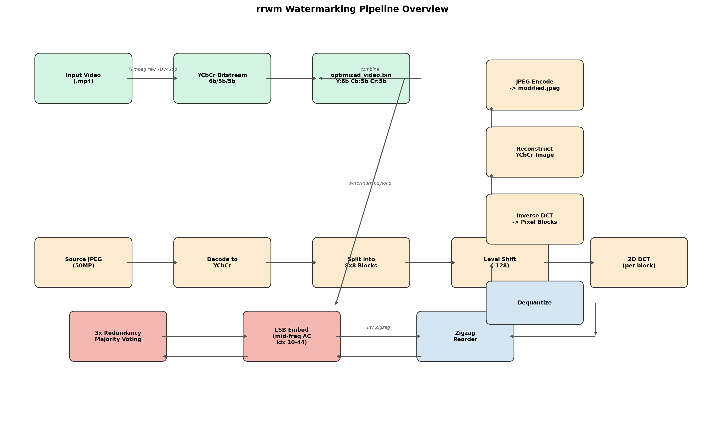

The system has two main pipelines:

1. **Encoder** (top): converts an input video into a compact YCbCr bitstream
2. **Embedder** (bottom): hides that bitstream inside a JPEG using the DCT domain
3. **Extractor** (reverse): reads back the bitstream and decodes the video

---

## Step 1 — Color Space: RGB → YCbCr

JPEG internally uses the **YCbCr** color space. The Y channel stores luminance (brightness),
Cb stores blue-difference chroma, and Cr stores red-difference chroma. Human vision is
much more sensitive to Y than to Cb/Cr, so JPEG takes advantage of this.

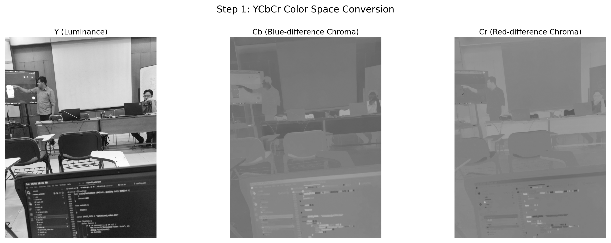

The converter uses **4:2:0 chroma subsampling** — Cb and Cr are stored at half the
spatial resolution of Y (both horizontally and vertically). This is why there are far
fewer Cb/Cr blocks than Y blocks.

In `converter/main.go`, the video frames are converted to raw YUV420p via FFmpeg:

```
ffmpeg -i input.mp4 -vf scale=WxH -f rawvideo -pix_fmt yuv420p -
```

Each Y pixel is stored with **6 bits** of precision (64 levels), while Cb/Cr use
**5 bits** (32 levels). This aggressive quantization is the primary source of compression
and is why the 50MP JPEG can hold multiple seconds of video.

---

## Step 2 — 8×8 Block Partitioning

The image is divided into non-overlapping 8×8 pixel blocks. Each block is processed
independently through the DCT pipeline. Blocks are processed in raster-scan order:
left-to-right, top-to-bottom.

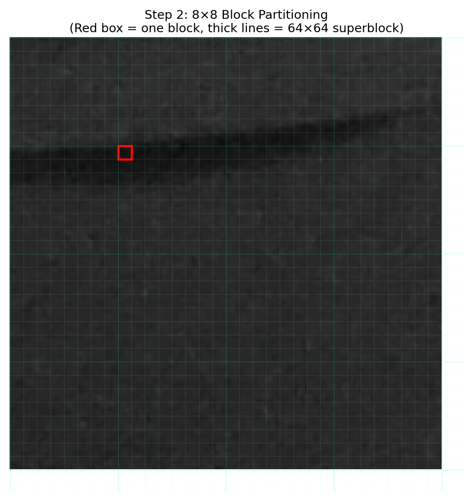

- **Y channel**: `6144 × 8192` → `(6144/8) × (8192/8) = 768 × 1024 = 786,432` blocks
- **Cb channel**: `3072 × 4096` → `384 × 512 = 196,608` blocks (due to 4:2:0 subsampling)
- **Cr channel**: same as Cb = 196,608 blocks
- **Total**: 1,179,648 blocks

The red box highlights a single 8×8 block used for the detailed walkthrough below.

---

## Step 3 — The DCT Transform

### 3a. Level Shift

Before the DCT, each pixel value (0–255 unsigned) is shifted by subtracting 128 to
produce signed values in the range −128…+127. This centers the data around zero so the
DCT can efficiently represent it.

### 3b. 2D Discrete Cosine Transform

Each 8×8 signed block is transformed using the 2D DCT Type-II:

```
                7   7
               ──  ──
F(u,v) = ¼·Cu·Cv · ╲   ╲   f(i,j) · cos((2i+1)uπ/16) · cos((2j+1)vπ/16)
                   ──  ──
                  i=0 j=0
```

Where:
- `F(0,0)` is the **DC coefficient** (average brightness of the block)
- `F(u,v)` for u>0 or v>0 are **AC coefficients** (spatial frequency components)
- `Cu = 1/√2` when u=0, otherwise 1 (same for Cv)

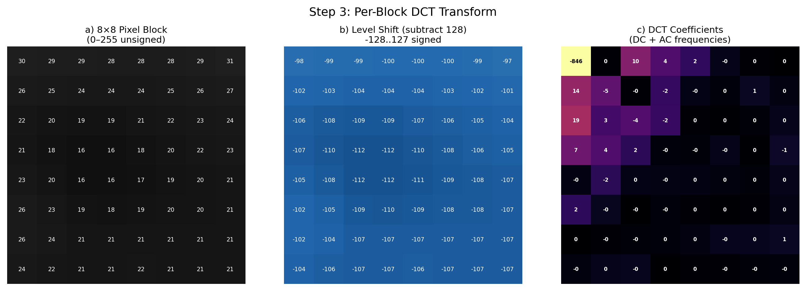

The DCT **concentrates energy** into the low-frequency coefficients (top-left corner).
In natural images, most of the visual information is in the DC and low-AC coefficients,
while high-frequency coefficients tend to be near zero.

### 3c. DCT Basis Functions

Each DCT coefficient corresponds to a specific 2D frequency pattern. The coefficient
value represents how strongly that pattern is present in the original 8×8 block.

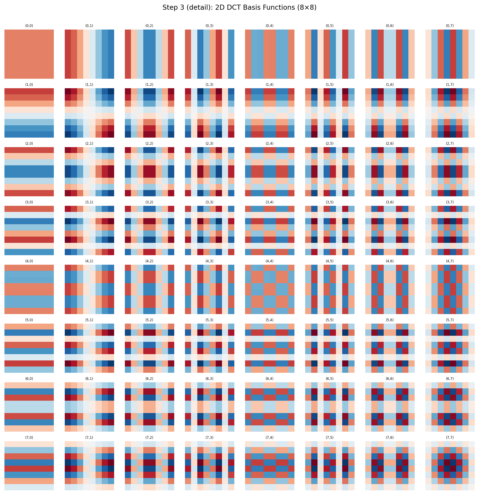

- **(0,0)** = DC — flat, uniform brightness
- **(0,1)**, **(1,0)** — lowest horizontal/vertical frequencies
- **(7,7)** — highest diagonal frequency (fine detail)

---

## Step 4 — Quantization

Quantization is the **lossy** step in JPEG compression. Each DCT coefficient is divided
by a corresponding entry from the quantization table and rounded to the nearest integer:

```
QuantizedCoeff = round(DCTCoeff / QTableEntry)
```

The quantization tables are designed to match human visual perception — high-frequency
coefficients get larger divisors, making them more likely to round to zero.

### Standard JPEG Quantization Tables

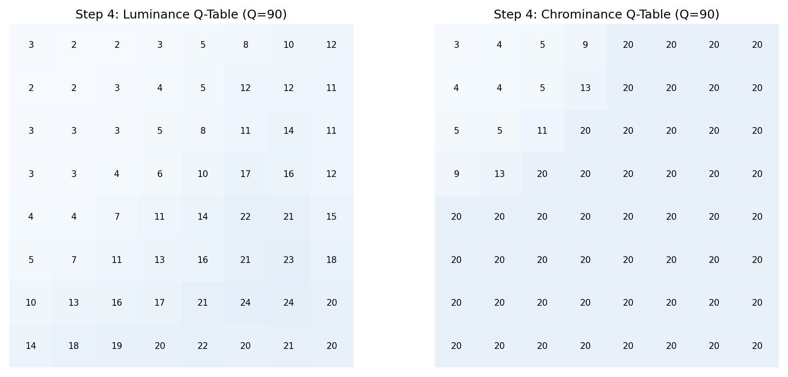

The **default tables** are from the JPEG specification. The scaling factor for quality Q:

```
Q < 50:  scale = 5000 / Q
Q >= 50: scale = 200 - Q×2
```

At Q=90 (the default for rrwm), the scaling factor is `200 − 180 = 20`, so the default
table values are multiplied by 0.2.

### Quantization in Action

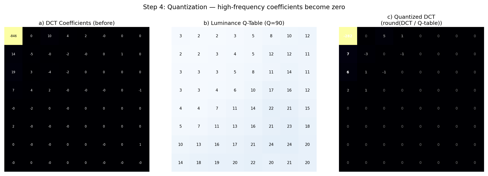

After quantization, many high-frequency coefficients become zero. This is what makes
JPEG compression work — the zeros can be run-length encoded efficiently in the next
step (zigzag ordering).

**Important for watermarking**: the quantization process determines which coefficients
survive re-compression. Using quality >= 90 ensures that the mid-frequency coefficients
we modify (indices 10–44 after zigzag) remain mostly intact after re-encoding.

---

## Step 5 — Zigzag Ordering

After quantization, the 8×8 coefficient matrix is reordered into a 1D sequence using
a zigzag pattern. This groups coefficients by frequency:

1. **DC coefficient** (index 0) — the average
2. **Low-frequency AC** (indices 1–9) — coarse structure
3. **Mid-frequency AC** (indices 10–44) — **embedding zone**
4. **High-frequency AC** (indices 45–63) — fine detail, usually zero after quantization

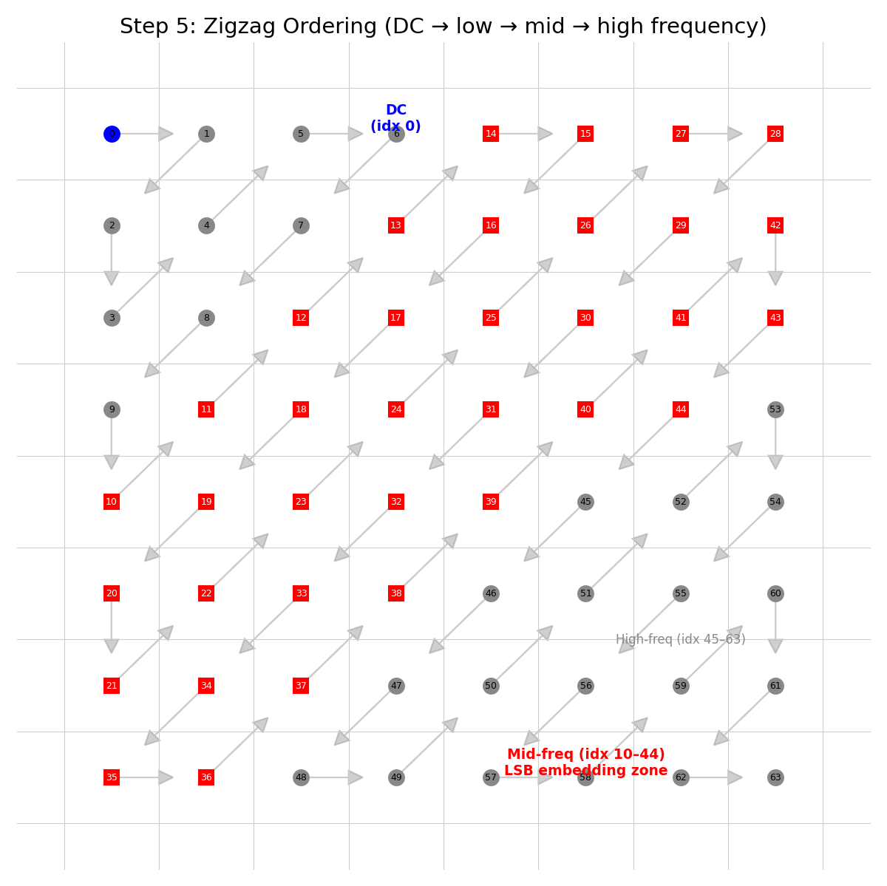

The zigzag ordering is advantageous because zeros naturally cluster at the end of the
sequence, enabling efficient run-length encoding in the JPEG bitstream.

The **embedding zone** (indices 10–44, shown in red) was chosen because:
- Low-frequency coefficients (0–9) are critical for visual quality — modifying them
  causes visible artifacts
- High-frequency coefficients (45–63) don't survive Q=90 re-compression well
- Mid-frequency coefficients provide a good trade-off between robustness and
  imperceptibility

---

## Step 6 — LSB Embedding

Each watermark bit is stored in the **Least Significant Bit** (LSB) of a quantized
mid-frequency DCT coefficient:

```
SetLSB(val, bit):
    if bit == 1: val |= 1     (make odd)
    if bit == 0: val &= ~1    (make even)
```

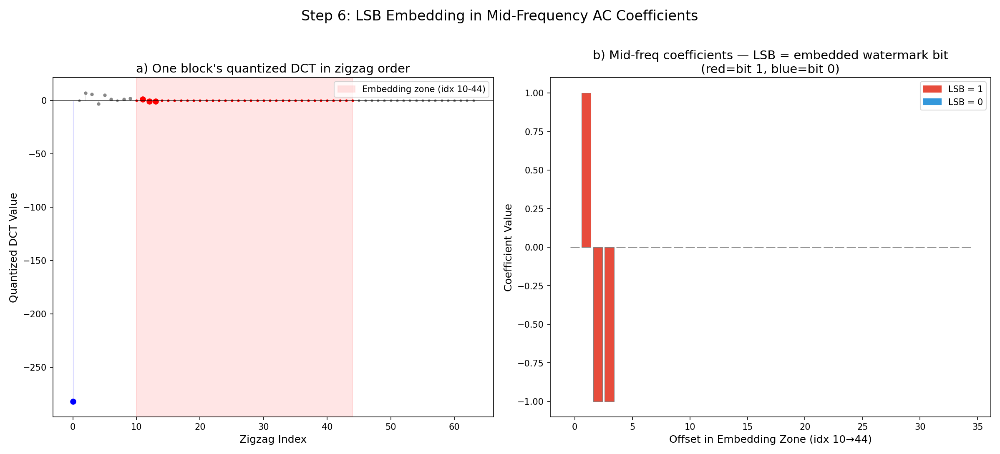

The left plot shows one full block's quantized DCT values in zigzag order. The red
highlighted region (indices 10–44, 35 coefficients per block) is where bits are
stored. The right plot shows these 35 coefficients with their LSB color-coded:
red = bit 1, blue = bit 0.

### Triple Redundancy

Every byte of the watermark is stored **3 times** with majority voting on extraction.
This is critical because JPEG re-compression (even at Q=90) will randomly flip some
LSBs. With 3x copies, the correct bit can be recovered from the majority.

```
Original payload:  [b0, b1, b2, ..., bn]
Triple payload:    [hdr, b0, ..., bn, b0, ..., bn, b0, ..., bn]
                    ^4-byte length prefix    ^copy 1   ^copy 2   ^copy 3
```

On extraction, for each byte position:
```
a = copy1[i]
b = copy2[i]
c = copy3[i]
if a == b or a == c: byte = a
else:                byte = b  (b == c guaranteed)
```

### Bitstream Format

The watermark is a binary file generated by `converter/main.go` (the encoder). It
contains video frames in a compact format:

```
[Header: 2B width, 2B height, 2B frame count]
[Frame 0: Y pixels in 6 bits each, Cb pixels in 5 bits, Cr pixels in 5 bits]
[Frame 1: ...]
```

Each frame is an **I-frame** (intra-coded, no P-frame deltas). For high-motion content,
I-frame encoding is actually more efficient than delta encoding because motion vectors
would consume more bits than they save.

---

## Step 7 — Full Pipeline: Insert + Extract

### Insertion Flow

1. Decode source JPEG → YCbCr
2. Split Y, Cb, Cr into 8×8 blocks
3. Level shift each block (−128)
4. 2D DCT on every block
5. Quantize (Y: luminance table, Cb/Cr: chrominance table, Q=90)
6. Zigzag reorder
7. For each coefficient in the embedding zone (indices 10–44), set LSB to the next
   watermark bit
8. Inverse zigzag → dequantize → inverse DCT → pixel blocks
9. Reconstruct YCbCr image → JPEG encode (at the same quality)

### Visual Comparison

The changes are imperceptible to the human eye. Below is a 512×512 crop comparison:

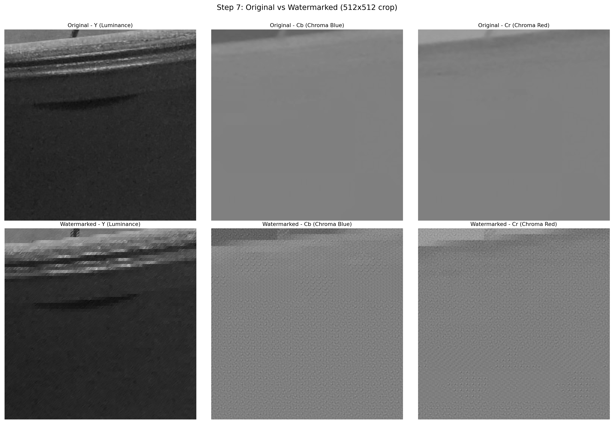

### Difference Map

The pixel-level difference (amplified by 10× for visibility) shows that the watermark
is encoded as subtle noise-like changes distributed across all channels:

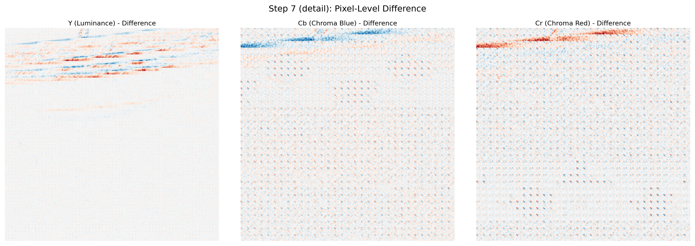

The difference is most visible in the Cb and Cr channels because:
- Chrominance tables are more aggressive (larger divisors)
- The Y channel dominates visual perception
- LSB flips on quantized values are ±1, a tiny fraction of the 0–255 range

### Extraction Flow

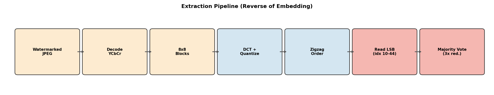

1. Decode watermarked JPEG → YCbCr
2. Split into 8×8 blocks
3. DCT + quantize (same tables as insertion)
4. Zigzag reorder
5. Read LSB from mid-frequency coefficients (indices 10–44)
6. Apply majority voting across 3 redundant copies
7. Decode bitstream to video using the converter

### Full Command

```
# One-shot pipeline
./run.sh full input.mp4

# Or step by step
./run.sh encode input.mp4                                    # → optimized_video.bin
./run.sh insert                                              # → modified.jpeg
./run.sh extract                                             # → secret.mp4
```

---

## Capacity Analysis

The 50MP JPEG provides enormous capacity for hidden data.

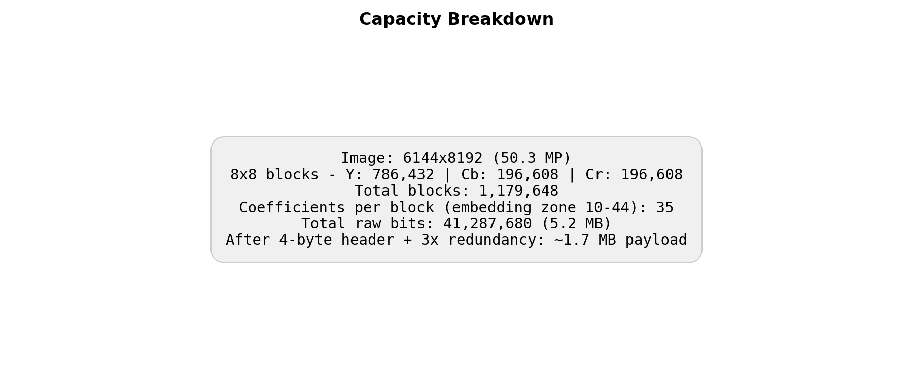

| Metric | Value |
|---|---|
| Image resolution | 6144 × 8192 (50.3 MP) |
| Y blocks | 768 × 1024 = 786,432 |
| Cb blocks | 384 × 512 = 196,608 |
| Cr blocks | 384 × 512 = 196,608 |
| Total blocks | 1,179,648 |
| Coefficients per block (embedding zone) | 35 |
| Total raw bits | 41,287,680 |
| Total raw bytes | ~5.16 MB |
| After 4-byte header + 3× redundancy | ~1.72 MB usable payload |

At 256×192 resolution (default) with Y:6b Cb:5b Cr:5b encoding:
- Each frame uses: `(256×192×6) + (128×96×5) + (128×96×5)` = 417,792 bits ≈ 52 KB
- Total capacity: ~33 frames of video (~3.3s at 10 fps)

---

## Detailed Go Implementation Reference

### Key Constants

| Constant | Value | Description |
|---|---|---|
| `blockSize` | 8 | DCT block dimension |
| `MIN_SAFE_DCT_FREQ_IDX` | 10 | Start of embedding zone |
| `MAX_SAFE_DCT_FREQ_IDX` | 45 | End of embedding zone (exclusive) |
| `yBits` | 6 | Y precision in bitstream |
| `cbBits` / `crBits` | 5 | Chroma precision in bitstream |

### Core Functions

| Function | Location | Purpose |
|---|---|---|
| `ImageToYCbCr()` | `main.go:380` | Extract YCbCr planes from JPEG |
| `BlocksToDCT()` | `main.go:498` | Forward DCT on all blocks |
| `DCT.Quantize()` | `main.go:307` | Divide by Q-table and round |
| `DCTsToZigZags()` | `main.go:513` | Zigzag reorder |
| `InsertBitsToZigZags()` | `main.go:709` | Embed watermark bits via LSB |
| `SetLSBQuantized()` | `main.go:343` | Single coefficient LSB modification |
| `GetLSBInt()` | `main.go:353` | Read LSB from a coefficient |
| `ZigZagsToDCTs()` | `main.go:550` | Inverse zigzag |
| `DCT.Dequantize()` | `main.go:323` | Multiply by Q-table |
| `DCTsToBlocks()` | `main.go:593` | Inverse DCT |

### Quantization Scaling

```go
func scaleQTable(base [64]int, quality int) [64]int {
    if quality < 50 {
        scale = 5000 / quality
    } else {
        scale = 200 - quality*2
    }
    // scaled[i] = clamp((base[i]*scale + 50) / 100, 1, 255)
}
```

---

## Why This Works

1. **DCT domain manipulation** — modifying coefficients in the frequency domain rather
   than pixel values distributes changes across the entire block, making them less
   visible

2. **Mid-frequency selection** — avoids DC (visible as block-level brightness shifts)
   and high frequencies (destroyed by quantization), using the sweet spot (indices
   10–44) where changes survive re-compression

3. **Triple redundancy** — JPEG re-encoding at quality 90 ±1 flips ~1–3% of LSBs;
   majority voting from 3 copies recovers the original bit with >99.9% reliability

4. **Chrominance exploitation** — Cb and Cr channels have coarser quantization tables,
   meaning each quantized step represents a larger pixel change, yet the human eye
   is less sensitive to chroma shifts

5. **All three channels** — using Y+Cb+Cr triples the available capacity without
   affecting visual quality, since the extra data goes into channels the eye barely sees
